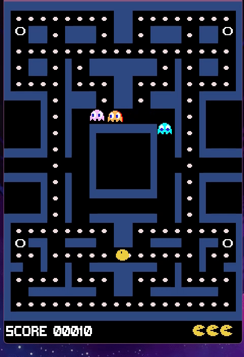

# ldts-project-assignment-g0902

# We present to you our version of Pac-Man!

In this version you can find Pac-Man, which is the character the player plays, coins that have different properties and ghosts that haunt Pac-Man trying to catch him!

The game goal in our version is that Pac-Man eats all the coins without being caught by the different ghosts while the difficulty, in this case the velocity of the ghosts, increases.

**Good luck trying to escape the ghosts and collecting as many coins as you can!**

  

This project was developed by Inês Cardoso ([up202005435@fe.up.pt](mailto:up202005435@fe.up.pt)), Joana Santos ([up202006279@fe.up.pt](mailto:up202006279@fe.up.pt)) and Mariana Carvalho ([up202007620@fe.up.pt](mailto:up202007620@fe.up.pt)) for LDTS 2021/2022.
