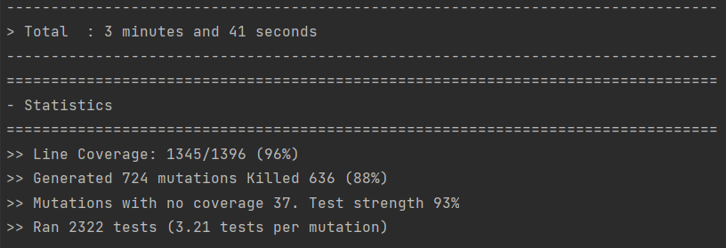

# ldts-project-assignment-g0902

# We present to you our version of Pac-Man!

## TABLE OF CONTENTS

- [Controls](#controls)
- [Implemented Features](#implemented-features) 
    - [Menu](#menu)
    - [Music](#music)
    - [Pac-Man Movement](#pac-man-movement)
    - [Game mode](#game-mode)
    - [Ghosts](#ghosts)
    - [Coins](#coins)
    - [Collisions](#collisions)
    - [Score](#score)
    - [Levels](#levels)
    - [End of Game](#end-of-game)
    - [Leaderboard](#leaderboard)
- [Architectural Pattern](#architectural-pattern)
- [Design Patterns](#design-patterns)
  - [Strategy Pattern](#strategy-pattern)
  - [Observer Pattern](#observer-pattern)
  - [State Pattern](#state-pattern)
  - [Singleton Pattern](#singleton-pattern)
- [Refactoring List](#refactoring-list)
- [Code Smells](#code-smells)
- [Tests](#tests)
  - [Coverage Report](#coverage-report)
  - [Pitest Report](#pitest-report)
- [Self-evaluation](#self-evaluation)

## CONTROLS

`^`: Moves Pac-Man up.

`v`: Moves Pac-Man down.

`>`: Moves Pac-Man to the right.

`<`: Moves Pac-Man to the left.

`X`: Closes the window where the game is playing.

`ESC`: Press ESC if you are in the instructions, or the leaderboard and want to return to the main menu.

`ENTER`: Press ENTER when you're playing if you want to finish the game and jump to the leaderboard.

## IMPLEMENTED FEATURES

### Menu

When starting the program, appears an initial menu where the user can choose to start playing, read the instructions, access the leaderboard or exit the game. When the game ends, after the leaderboard page is shown, the player returns to the initial menu.
 - Start game;
 - Instructions - Shows the basic controls and the goal of the game;
 - Leaderboard - Shows previous and recent scores;
 - Exit game;

### Music

Throughout the gameplay there is backgroud music that enhances the whole experience. When the program is started we are faced with a beautiful song that continues throughout all menus (instructions and leaderboard) and that changes when we finaly decide to start the game. In the gameplay itself we come across the relaxing sound of the ghost trying to kill us whilst we're running for our lives trying to collect all the money(when the ghosts are in the chase and scatter mode). We can also experience the sound of ghosts screaming while we take our revenge on them (when we eat the power coin and they enter frightened mode). After we win or lose the game we can also hear an amazing tune while our score is being presented.

### Pac-Man Movement

Pac-Man moves using the arrow keys. If the player wants to keep moving in the same direction he will only need to press one time the arrow key in the desired direction.

However, if Pac-Man bumps into a wall he stops and waits for the next direction. So, whenever the player wishes Pac-Man to change direction he needs to press an arrow key.

Let’s imagine a scenario: the player pressed the right arrow key and Pac-Man is now moving to the right; if the player presses the up arrow key and Pac-Man has walls in the up direction, meaning he can’t move up, the moment Pac-Man is able to move upwards he moves without needing another input from the player. The function that handles this implementation is called **pacmanMoving** and it's a method from the class [GameModel](../src/main/java/g0902/model/GameModel.java).

The class that handles the input from the user and makes [Pacman](../src/main/java/g0902/model/MapElements/Pacman.java) move is [PacmanController](../src/main/java/g0902/control/PacmanController.java).

### Game mode

There are three different game modes. In order to understand them better let’s name them: we have the “**Chase**” mode, “**Scatter**” and the “**Frightened**” mode.

The main mode is “**Chase**”. This is when the ghosts are trying to capture Pac-Man. Then, in “**Scatter**” mode, the ghosts stop chasing Pac-Man and each will move to its respective corners. This mode only lasts for a few seconds then changes back to “**Chase**”. In this two modes each ghost has its own implementation. The last game mode is “**Frightened**” and it happens when Pac-Man eats a special coin. In this mode the ghosts move randomly so they aren’t trying to catch Pac-Man. Also, in this mode they are vulnerable because Pac-Man can eat them. When a ghost is eaten it returns to its original position on either chase or scatter mode.  

Classes: [ChaseMode](../src/main/java/g0902/model/MapElements/Ghosts/MoveMode/ChaseMode), [ScatterMode](../src/main/java/g0902/model/MapElements/Ghosts/MoveMode/ScatterMode), [FrightenedMode](../src/main/java/g0902/model/MapElements/Ghosts/MoveMode/FrightenedMode).

### Ghosts

Ghost types - There are four types of ghosts: Blinky (the red one), Pinky (the pink one), Inky (the blue one) and Clyde (the orange one).

Classes: [Blinky](../src/main/java/g0902/model/MapElements/Ghosts/Types/Red.java), [Pinky](../src/main/java/g0902/model/MapElements/Ghosts/Types/Pink.java), [Inky](../src/main/java/g0902/model/MapElements/Ghosts/Types/Cyan.java), [Clyde](../src/main/java/g0902/model/MapElements/Ghosts/Types/Orange.java)

Each ghost has a different tactic to catch Pac-Man. These are applied when the game is in “**Chase**” mode ([Game mode](#game-mode)).

- **Blinky**: follows Pac-Man once located. 
  - Implemented in these classes: [TargetChaseStrategy](../src/main/java/g0902/model/MapElements/Ghosts/MoveMode/ChaseMode/ChaseStrategys/TargetChaseStrategy.java), [AggressiveTargetStrategy](../src/main/java/g0902/model/MapElements/Ghosts/MoveMode/ChaseMode/TargetStrategys/AggressiveTargetStrategy.java)

- **Pinky**: tries to ambush Pac-Man by getting in front of him.
  - Implemented in these classes: [TargetChaseStrategy](../src/main/java/g0902/model/MapElements/Ghosts/MoveMode/ChaseMode/ChaseStrategys/TargetChaseStrategy.java), [AmbushTargetStrategy](../src/main/java/g0902/model/MapElements/Ghosts/MoveMode/ChaseMode/TargetStrategys/AmbushTargetStrategy.java)

- **Inky**: tries to trick Pac-Man using both Pac-Man's position and direction as well as Blinky's (the red ghost) position in his calculation.
  - Implemented in these classes: [TargetChaseStrategy](../src/main/java/g0902/model/MapElements/Ghosts/MoveMode/ChaseMode/ChaseStrategys/TargetChaseStrategy.java), [PatrolTargetStrategy](../src/main/java/g0902/model/MapElements/Ghosts/MoveMode/ChaseMode/TargetStrategys/PatrolTargetStrategy.java)

- **Clyde**: moves randomly and appears to stay away from Pac-Man.
  - Implemented in these classes: [RandomChaseStrategy](../src/main/java/g0902/model/MapElements/Ghosts/MoveMode/ChaseMode/ChaseStrategys/RandomChaseStrategy.java)

When the game is in “**Scatter**” mode ([Game mode](#game-mode)) the following tactics apply:

- **Blinky**: moves to the top right corner.

- **Pinky**: moves to the top left corner.

- **Inky**: moves to the bottom right corner.

- **Clyde**: moves to the bottom left corner.    

### Coins

Coins have two different types: [Small Coin](../src/main/java/g0902/model/MapElements/Coins/SmallCoin.java) and [Power Coin](../src/main/java/g0902/model/MapElements/Coins/PowerCoin.java).

When Pac-Man eats either a **Small Coin** or a **Power Coin** his score increases. However, if he eats a **Power Coin**  that’s when **“Frightened”** mode is activated ([Game mode](#game-mode)).

The positions of the coins are read from the map text file and during the game no more coins appear. The player wins if Pac-Man eats all the coins.

### Collisions

There are implemented many types of collisions:
- Pac-Man and the walls, which prevents Pac-Man from moving through walls. 
- Pac-Man and Small coins, which increases Pac-Man's score.
- Pac-Man and Power coins, which increases Pac-Man's score and changes the Game Mode.
- Pac-Man and Ghosts, which leads to the end of the game.
- Ghosts and the walls, which prevents the ghosts from moving through walls.

The collision methods are implemented in the class [GameModel](../src/main/java/g0902/model/GameModel.java).

### Score
Pacman can gain points to increase his score in several ways:
- By eating a **small coin**, which adds **10** points to Pac-Man's score.
- By eating a **power coin**, which adds **200** points to Pac-Man's score.
- By eating **ghosts** when the Frightened Game Mode is activated. In each activation of this mode the first ghost eaten gives **200** points, the second **400** points, the third **600** points, and the fourth **800** points.

### Levels
After all coins were eaten by pacman, we move up a level, where everything is the same but the time of the frightened mode, that is reduced, and the time of scatter mode, that is enhanced. We also have a limmit of 15 levels and if you can beat them all you are anounced the winner of the game!

The levels are changed in [GameState](../src/main/java/g0902/states/GameState.java) that call the function next level in [Configuration](../src/main/java/g0902/Configuration.java)

### End of Game
When Pac-Man eats all the coins without being caught by ghosts appears a message to the player saying "You win". When the player is eaten by a ghost the final message is "Game Over". The player is proceeded to the Leaderboard.
### Leaderboard

When the game ends either the player wins or loses, he asked for his name. Both the name and his score are saved to a file with previous rankings that's updated and reordered by score. 

Class: [RankingsMenuModel](../src/main/java/g0902/model/Menu/RankingsMenuModel.java).

## ARCHITECTURAL PATTERN

**Problem in context**

Without any structural pattern the Single Principle Responsibility could be broken, so we decided to implement the MVC pattern. With it, it's possible to separate the data, interface and control of the game to have more code reusability and to make the code more organized and easy to implement.

**Pattern**

This particular pattern is useful for games and web applications because it helps separate the input logic that is converted to commands for either the Model or View (handled by the Controller); the data, game logic and rules of the game (handled by the Model) and the user interface that outputs information (handled by the View).

We started working considering the Model the central component of the pattern being a more "active Model". That said, we have this component manage the data, logic and rules of the application. On the other side, our Controller is responsible for accepcting input and converting it to commands for the Model and the View.

If we wanted to reedo some parts of the project's structure we could implement some classes and methods that we now have in the Model component of the MVC in the Controller component.

**Implementation**

**Consequences**

This architecture enables quick changes without having to rework much code in all layers of the application and helps to test components independently.

## DESIGN PATTERNS

### Strategy Pattern

**Problem in context**

In our code, Ghost's have three types of move behaviour. Scatter, Frightened and Chase. On chase mode there are two types of chasing. One that is random (ChaseRandom), and other that tries to reach a target (ChaseTarget). Furthermore, each ghost has a different way of defining a target. And this was where our problem relied on. We needed a pattern design that could allow us to make changes to those behaviours without affecting the parts that stays the same.

**Pattern**

Implementing the Strategy pattern means taking a big class that does something in many ways and separating the different algorithms into separate classes. So in our case, 
we decided to create two interfaces: [ChaseStrategy](../src/main/java/g0902/model/MapElements/Ghosts/MoveMode/ChaseMode/ChaseStrategys/ChaseStrategy.java) and [TargetStrategy](../src/main/java/g0902/model/MapElements/Ghosts/MoveMode/ChaseMode/TargetStrategys/TargetStrategy.java). ChaseStrategy has two implementations: [RandomChaseStrategy](../src/main/java/g0902/model/MapElements/Ghosts/MoveMode/ChaseMode/ChaseStrategys/RandomChaseStrategy.java) and [TargetChaseStrategy](../src/main/java/g0902/model/MapElements/Ghosts/MoveMode/ChaseMode/ChaseStrategys/TargetChaseStrategy.java). 
TargetChaseStrategy has a TargetStrategy that is either an [AmbushTargetStrategy](../src/main/java/g0902/model/MapElements/Ghosts/MoveMode/ChaseMode/TargetStrategys/AmbushTargetStrategy.java), or an [AggressiveTargetStrategy](../src/main/java/g0902/model/MapElements/Ghosts/MoveMode/ChaseMode/TargetStrategys/AggressiveTargetStrategy.java) or a [PatrolTargetStrategy](../src/main/java/g0902/model/MapElements/Ghosts/MoveMode/ChaseMode/TargetStrategys/PatrolTargetStrategy.java).

**Implementation**

**Interfaces**: [ChaseStrategy](../src/main/java/g0902/model/MapElements/Ghosts/MoveMode/ChaseMode/ChaseStrategys/ChaseStrategy.java), [TargetStrategy](../src/main/java/g0902/model/MapElements/Ghosts/MoveMode/ChaseMode/TargetStrategys/TargetStrategy.java).

**ChaseStrategy** - **Classes implementing**
  - [RandomChaseStrategy](../src/main/java/g0902/model/MapElements/Ghosts/MoveMode/ChaseMode/ChaseStrategys/RandomChaseStrategy.java);
  - [TargetChaseStrategy](../src/main/java/g0902/model/MapElements/Ghosts/MoveMode/ChaseMode/ChaseStrategys/TargetChaseStrategy.java);
      
**TargetStrategy** - **Classes implementing**
  - [AggressiveTargetStrategy](../src/main/java/g0902/model/MapElements/Ghosts/MoveMode/ChaseMode/TargetStrategys/AggressiveTargetStrategy.java);
  - [AmbushTargetStrategy](../src/main/java/g0902/model/MapElements/Ghosts/MoveMode/ChaseMode/TargetStrategys/AmbushTargetStrategy.java);
  - [PatrolTargetStrategy](../src/main/java/g0902/model/MapElements/Ghosts/MoveMode/ChaseMode/TargetStrategys/PatrolTargetStrategy.java);

**Consequences**

With the implementation of this pattern, it's easier to introduce new strategies without having to change the context, and the code stays more organized.

### Observer Pattern
**Problem in context**

When there are objects that are interested in the actions of another object it's not beneficial for those objects to be constantly checking whether something happened or not. Probably most of those check-ups would be pointless. In our project the problem was that certain classes needed to be notified when there was user input.

**Pattern**

The Observer pattern is useful when there are objects waiting to be notified when an event happens to the object they are observing, because when that happens they also need to be changed.
In our project, the Observer Pattern was implemented in the MenuController class and in the PacmanController class, since they both implement the subscriber interface Observer. Both classes are waiting to be notified when there's user input. When they are notified of input they act and make the application progress.
In this case the class ReadKeys is the publisher and the classes MenuController and PacmanController are the subscribers.

**Implementation**

- Observer classes: [EndScreenController](../src/main/java/g0902/control/EndScreenControler.java), [PacmanController](../src/main/java/g0902/control/PacmanController.java), [InstructionMenuController](../src/main/java/g0902/control/InstructionMenuController.java), [RankingsMenuController](../src/main/java/g0902/control/RankingsMenuControler.java), [MenuController](../src/main/java/g0902/control/MenuController.java);
- Subject class: [ReadKeys](../src/main/java/g0902/control/ReadKeys.java). 

**Consequences**

When implementing this pattern it enables objects to establish relations between them at runtime and respects the Open/Closed Principle since it's easy to introduce new subscriber classes without having to change the publisher's code (class [ReadKeys](../src/main/java/g0902/control/ReadKeys.java)).

### State Pattern

**Problem in context**

In our project there were many states possible: the one related to the game ([GameState](../src/main/java/g0902/states/GameState.java)), to the leaderboard page ([RankingsMenuState](../src/main/java/g0902/states/RankingsMenuState.java)), to the instructions page ([InstructionMenuState](src/main/java/g0902/states/InstructionMenuState.java)), to the ending game screen ([EndScreenState](src/main/java/g0902/states/EndScreenState.java)) and to the main menu ([MainMenuState](src/main/java/g0902/states/MainMenuState.java)).
Without any design pattern properly defining them, the code was messy and there were bulky state machine conditionals. Because of this, we decided to implement the State Pattern.

**Pattern**

The State pattern allows an object to alter its behavior when its internal state changes. By extracting the code related to the specific state behavior into separate classes, the object is forced to assign the work to an instance of these classes instead of acting on its own.

**Implementation**

- Abstract class: [State](../src/main/java/g0902/states/State.java);

- Classes that extend State: [EndScreenState](../src/main/java/g0902/states/EndScreenState.java), [GameState](../src/main/java/g0902/states/GameState.java), [InstructionMenuState](../src/main/java/g0902/states/InstructionMenuState.java), [MainMenuState](../src/main/java/g0902/states/MainMenuState.java), [RankingsMenuState](../src/main/java/g0902/states/RankingsMenuState.java).

**Consequences**

By implementing the State pattern, the bulky state machine conditionals are eliminated and the code becomes more organized because the code related to different behaviors is moved into separate classes (Single Responsibility Principle) and finally, when introducing new states there's no need to change existing states (Open/Closed Principle).

### Singleton Pattern

**Problem in context**

The class [Configuration](../src/main/java/g0902/Configuration.java) is what implements the increasing of difficulty and advancing levels. Therefore, it is an important class and its instances are utilized many times and in different ways all along the code. That being said, controlling various instances of the same class is harder to manage and doesn't benefit the program.

**Pattern**

The Singleton pattern ensures that a class, in this case the Configuration class, has just a single instance ("the official one"). It also allows access to that object throught out the whole code while protecting that instance from being overwritten. This is achieved by making the default constructor private, to prevent other objects from using the new operator with the Configuration class and by adding a static creation method that acts as a special constructor. This method calls the private constructor to create an object and saves it in a static field (our's is called config). When this method is called, that static object is returned.

**Implementation**

- Class implementing singleton: [Configuration](../src/main/java/g0902/Configuration.java).
- Client classes: [Ghost](../src/main/java/g0902/model/Game/MapElements/MovingElements/Ghosts/Ghost.java), [GameState](../src/main/java/g0902/states/GameState.java), [GameModel](../src/main/java/g0902/model/Game/GameModel.java), [MainMenuState](../src/main/java/g0902/states/MainMenuState.java) and [EndScreenState](../src/main/java/g0902/states/EndScreenState.java).

**Consequences**

By implementing the Singleton pattern, as said before, it's ensured that the class Configuration has only a single instance. There is global access to that instance and that object is only initialized when it's requested fo the first time. However, there are negative consequences when implementing the singleton pattern: the Single Responsibility Pattern is violated and bad designing can be masked.

## Refactoring List

Refractoring: **Model.Ghost and Model.Pacman**
 - Extracted super class MovingObject from Pacman and Ghost.
 - Code smell eliminated: Duplicated Code and Long Classes.
 - [Commit](https://github.com/FEUP-LDTS-2021/ldts-project-assignment-G0902/commit/56634656e442030a4734477e8eb3a7549888e36a)

Refractoring: **Model.Ghost**
 - Renamed variable "score" to "ghost value on Model.Ghost.
 - Renamed function getScore to getGhostValue on Model.Ghost.
 - [Commit](https://github.com/FEUP-LDTS-2021/ldts-project-assignment-G0902/commit/0a2d9497e3304037ee8f67b4289a0ead116cdefc)

Refractoring: **Model.Pacman**
 - Renamed variable "highScore" to "Score" on Model.Pacman.
 - Renamed function "getHighscore" to "getScore" on Model.Pacman.
 - [Commit](https://github.com/FEUP-LDTS-2021/ldts-project-assignment-G0902/commit/0a2d9497e3304037ee8f67b4289a0ead116cdefc)

Refractoring: **Model.MapReader**
 - Substitute algorithm to read Map Elements, and create Map.
 - Code smell eliminated: Duplicated Code and Long Method.
 - Created enum for MapElements symbols, so code would be cleaner.
 - [Commit](https://github.com/FEUP-LDTS-2021/ldts-project-assignment-G0902/commit/873fa8129559cea8dff0fa9910ede511406df329)

Refractoring: **Model.GameModel** - 
 - Extrated methods: powerCoinCollisions and smallCoinCollisions from coinCollisions.
 - Code smell eliminated: Long method with high complexity.
 - [Commit](https://github.com/FEUP-LDTS-2021/ldts-project-assignment-G0902/commit/ffef36333e5894c9b8147bee5fa2efcc91958a14)

Refractoring: **LanternaGui**
 - Replaced magic numbers with symbolic constants (MENU_SCREEN_WIDTH, MENU_SCREEN_HEIGHT, GAME_SCREEN_WIDTH AND GAME_SCREEN_HEIGHT).
- [Commit](https://github.com/FEUP-LDTS-2021/ldts-project-assignment-G0902/commit/2813d934ba7686e081a0afb8a838a1184002d4e7)

Refractoring: **Model.MainMenuModel**
 - Removed repeated code from selectPrevious and selectNext on MainMenuModel, and putted it on MenuElement.
 - Code smell eliminated: Duplicated code.
- [Commit](https://github.com/FEUP-LDTS-2021/ldts-project-assignment-G0902/commit/51da8271117d5926b3825a2751af12b1aa920fc2)

Refractoring: **Model.ScatterMode, Model.ChaseMode, Model.FrightenedMode**
 - Many of the functions related to the ghost's movement mode had repeated code, so extracted it and moved to the class MovingBehaviour
 - Commit: 
    - [Frightened Mode refractoring commit](https://github.com/FEUP-LDTS-2021/ldts-project-assignment-G0902/commit/881137ae9e3f00f492276760c50e2a37e838c7bf)
    - [Scatter Mode refractoring commit](https://github.com/FEUP-LDTS-2021/ldts-project-assignment-G0902/commit/28bcea7fc6391c5a9ba416c3b28a3c9594e080c5)

Refractoring: **Functions responsible for drawing elements**
 - Eliminated the magic numbers by putting the colors code on constants.

**Error Prone Warnings:**
Thanks to error prone we were also able to fix some troubles in our code such as:
   - Classes importing unused classes.
   - Lack of "@Override" in some functions.
   - In functions with catch and try, instead of "e.printstacktrace()", we changed to System.out.println("Erro: " + e.getMessage())
   - In fucntions reading the files, instead of having a file reader and a buffered reader, changed it to "BufferedReader br = Files.newBufferedReader(Paths.get(mapLocation), Charset.defaultCharset());"
   
   
## Code Smells

**Lazy classes - Dispensables**

There are two classes: [Constants](../src/main/java/g0902/Constants.java) and [Draws](../src/main/java/g0902/Draws.java) that can be considered lazy classes since they don't do anything. They only have public static fields and don't have methods. However, both classes were created to support possible future changes. 

For example, if in the future we want Pac-Man to be a different color, instead of having to change the color code in every instance Pac-Man's view is drawn we simply have to go to the Constants class and alter the respective field. The same happens with the Draws class. If we want to change an object's draw its easier and faster if we just have to change it in one place.

## Tests

### Coverage Report

### Pitest report

## Self-evaluation

    - Inês Cardoso - 33.33%
    - Joana Santos - 33.33%
    - Mariana Carvalho - 33.33%
